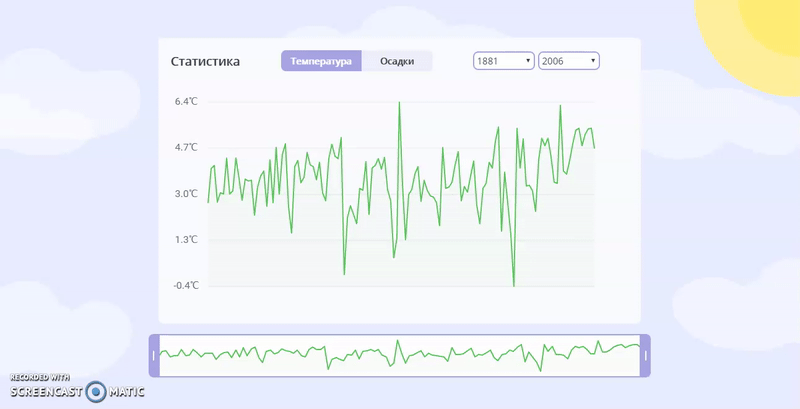

# Chart with weather statistics

**DEMO: https://tanyaignatenko.github.io/weather-statistics/**

 * Implemented a component using only JS (it was a requirement of this test task).
 * Implemented a chart using Canvas API.
 * Solved a problem of optimizing a calculation of average month values and a calculation chart coordinates by calculating them in WebWorker and by memoizing results in IndexedDB.
 * Implemented a slider to select a period for the chart with preview of the whole chart.

## Screenshots

