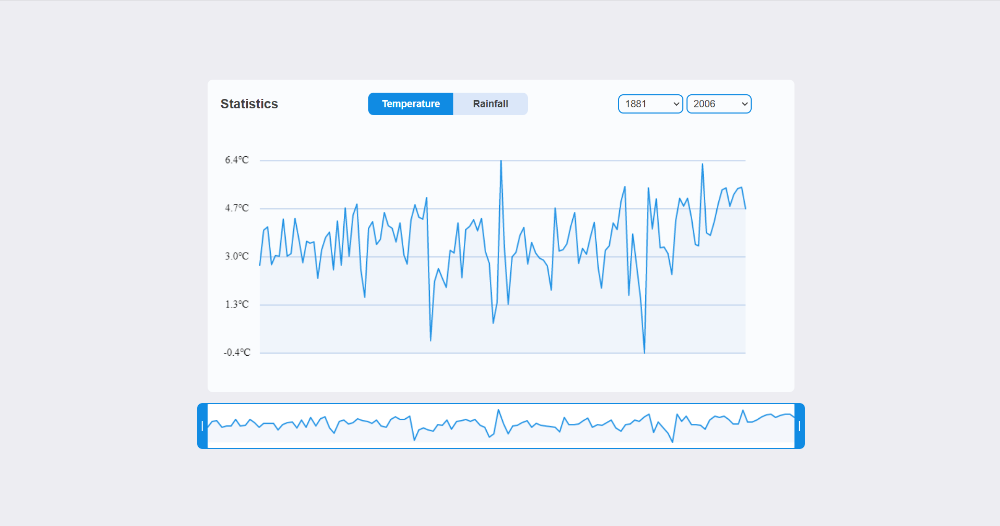

# Chart with weather statistics

**Demo: https://tanyaignatenko.github.io/weather-statistics/**

Technologies: Vanilla JS, HTML, CSS, Canvas, Web Workers, IndexedDB

- Built a chart with a slider with a preview of the entire chart
- Optimized the calculation of chart coordinates using Web Workers and IndexedDB

